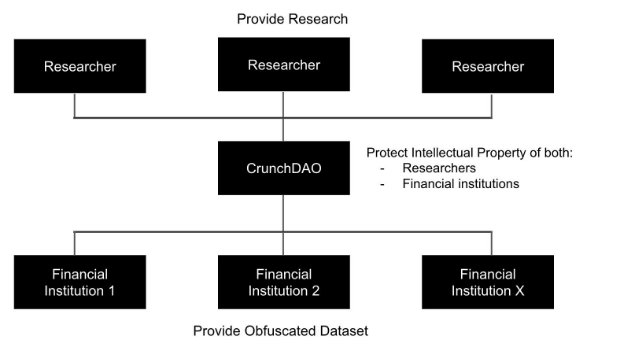
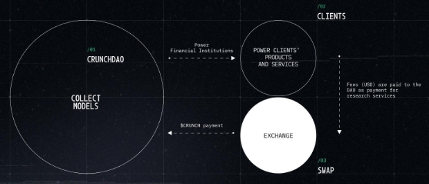
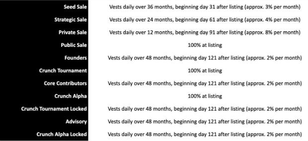
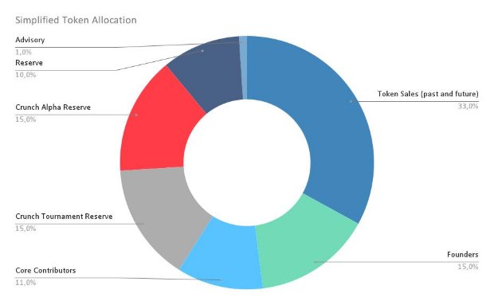
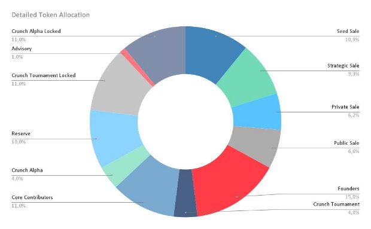

\newpage

## Summary

1. [**Definitions**](#definitions)
2. [**Predicting the Market: a community led research framework**](#predicting-the-market-a-community-led-research-framework)
   1. [The limitation of Machine Learning in Finance](#the-limitation-of-machine-learning-in-finance)
   2. [Our framework to power financial institutions](#our-framework-to-power-financial-institutions)
   3. [Decentralized Science Capabilities](#decentralized-science-capabilities)
3. [**Tokenomics**](#tokenomics)
   1. [Business operations](#business-operations)
   2. [Token type](#token-type)
   3. [Crunch Token Issuance and Initial Distribution](#token-issuance-and-initial-distribution)
   4. [Vesting](#vesting)
   5. [Token split](#_page9_x72.00_y303.80)
   6. [Simplified token allocation](#simplified-token-allocation)
   7. [Detailed token allocation](#detailed-token-allocation)
4. [**Governance and Organization**](#governance-and-organization)
   1. [The DAO choice](#the-dao-choice)
   2. [Current organizational structure](#current-organizational-structure)

\newpage

## Definitions

**Circulating Supply:** Circulating Supply refers to the number of coins or tokens of a specific cryptocurrency that are publicly available to buy or sell. If you can trade them, they are considered circulating.

**Decentralized Science:** Decentralized science (DeSci) is a Web3 movement whose primary goal is to upgrade traditional science and build public infrastructure for scientific research, publication, and funding using advanced tools and technologies such as blockchain, non-fungible tokens (NFTs), decentralized autonomous organizations (DAOs), crypto tokens, and smart contracts.

**ERC20 Token:** ERC-20 is the technical standard for fungible tokens created using the Ethereum blockchain. A fungible token is interchangeable with another token—where the well-known non-fungible tokens (NFTs) are not interchangeable.

ERC-20 allows developers to create smart-contract-enabled tokens that can be used with other products and services. These tokens are a representation of an asset, right, ownership, access, cryptocurrency, or anything else that is not unique in and of itself but can be transferred.

**Max Supply:** The maximum supply of a cryptocurrency refers to the maximum number of coins or tokens that will be ever created. This means that once the maximum supply is reached, there won't be any new coins mined, minted or produced in any other way. Normally, the maximum supply is capped by the limits defined by the underlying protocol of each digital asset.

**Meritocratic:** a social system in which people's success or power is related to their abilities, talent and achievements rather than social status

**Total Supply:** Total supply refers to the number of coins or tokens that currently exist and are either in circulation or locked somehow. It is the sum of coins that were already mined (or issued) minus the total of coins that were burned or destroyed.

Therefore, the total supply includes both the circulating supply and the coins that are yet to hit the open market.

**Vesting:** Vesting refers to the locking up/allocation of a certain percentage of the max circulation of the token before the initial coin offering (ICO) or initial DEX offering (IDO) for the primary parties involved in the project.

**DAO:** A decentralized autonomous organization (DAO) is an entity with no central leadership, governed by a community organized around a specific set of rules enforced on a blockchain. Decisions are made from the bottom-up, via proposals the group votes on during a specified period. DAOs are internet-native organizations collectively owned and managed by their members. They have built-in treasuries that are only accessible with the approval of their members.

**Heteroscedasticity:** heteroskedasticity happens when the standard deviations of a predicted variable, monitored over different values of an independent variable or as related to prior time periods, are non-constant.

**Leptokurtic:** Leptokurtic distributions are statistical distributions with kurtosis greater than three. It can be described as having a wider or flatter shape with fatter tails resulting in a greater chance of extreme positive or negative events.

**Machine Learning:** the use and development of computer systems that are able to learn and adapt without following explicit instructions, by using algorithms and statistical models to and draw inferences from patterns in data.

**Overparametrized:** A model having more parameters than can be estimated from the data.

**Stationarity:** Weak stationarity is a type of time series in which mean and covariance are timeshift-invariant. Strict stationarity is a type of time series in which the entire probability distribution is timeshift-invariant.

\newpage

## Predicting the Market: a community led research framework

### The limitation of Machine Learning in Finance

The efficiency of machine learning models relies heavily on the signal-to-noise ratio of the data it's trained on. A high signal-to-noise environment, like computed vision (face recognition), is easy to predict since the signal outweighs the noise, such as background images or blur.

The signal-to-noise ratio is a measure of how much useful information is contained in the data, compared to the amount of noise or irrelevant information. The higher the signal-to-noise ratio, the more predictable the data is, and the more accurate the machine learning models will be.

However, as a consequence of arbitrage forces, financial systems exhibit low signal-to-noise ratios (López de Prado 2015) making them far noisier, unpredictable and challenging for machine learning algorithms to navigate. Even the best investment portfolio experiences unpredictable swings in performance due to exogenous (unexpected news, pandemics: black swans) or endogenous forces that influence profit maximization and competition. Market participants exploiting information to predict future market performance only contributes to increasing the noise in the market, thus reducing predictability.

Moreover, financial markets are dynamic, and market trends are constantly evolving. When researchers identify a new signal that can predict price misalignments, the more traders that act on this information, the quicker the market corrects itself. This process leads to a change in the data generating process, making it difficult for machine learning models to predict market trends accurately. Technological advancements can also reshape how markets function, further complicating the system.

In a nutshell, finding stable and robust machine learning signals in financial data is difficult due to the high level of noise. It is also challenging due to the fact that it is:

1. High-dimensional with hundreds of parameters to take into account for modeling;
1. Prone to overfit because of overparameterization;
1. Strongly non-gaussian (leptokurtosis) statistics (Mandelbrot, Van Ness 1968) meaning that high risk events will occur (Covid, Subprime crisis etc.);
1. Non-stationary data (e.g., heteroscedasticity).

Financial markets are complex, and the frontiers of machine learning research have a long way to go in developing tools to navigate them.

CrunchDAO offers an elegant way to contribute to market predictions by offering thousands of AI models on the fly using a community-led research approach, to speed up the research phase while increasing modeling performance in finance.

### Our framework to power financial institutions

In this context, CrunchDAO proposes a protocol to act as a secure, third-party intermediary to collect models and forecasts from its members and run them for customers while preserving the intellectual property of the DAO’s members.

The protocol is:

- Collecting unique and rare sets of skills, ideas and alternative data;
- Process data to maximize the output of the participants’ models;
- Allowing the community to build machine learning models upon this refined data without sharing their codes and models with third parties outside of the DAO hence keeping their IP;
- Ensembling all the predictions into one unified signal that maximizes the likelihood of the DAO’s estimation;
- Market the predictions and signals to potential customers;
- Receive $CRUNCH from its customer and redistribute $CRUNCH to the community according to the quality of their insights.

The above steps are supported by a Decentralized Science Platform in order to build knowledge incrementally.

### Decentralized Science Capabilities

[CrunchDeSci](https://desci.crunchdao.com/projects) is a community-led, Open Science research framework, allowing users to build knowledge incrementally through scientific research papers proposed on its platform.

Our platform supports all the research and complex discussions within the DAO. It has 3 main properties (see the [DeSci Framework paper](https://desci.crunchdao.com/projects/crunchdao/desci-framework) for more):

**Standing on the shoulders of giants:** our framework allows researchers and alpha providers to discover truth by building easily on previous discoveries.

**Reproducibility:** the tight integration of literature review, code development, data and documentation is reflected in the infrastructure, enabling anyone to rebuild a scientific work in a few lines of code.

**Immutable and transparent:** building on GIT and IPFS all contributions and peer reviews are transparent and, stored on the InterPlanetary File System, are durable and decentralized by design.

## Tokenomics

The aim of CrunchDAO is to keep its tokenomics simple, powerful and sustainable.

### Business operations

The decentralized research team within the DAO produces machine learning models. The models are ensembled and sold to CrunchDAO’s clients - mainly asset managers and financial institutions.

Clients pay fees to access CrunchDAO’s financial services.

### Token type

The $CRUNCH Token is a currency used to incentivize the CrunchDAO’s members for their services. $CRUNCH is an ERC20 Ethereum tokenThe source code of the CrunchDAO smart contract is transparent and [easily accessible by anyone](https://github.com/crunchdao/contracts).

The token contract address is: **0x74451d2240ef9e86b3cea815378af61566b81856**

### Token Issuance and Initial Distribution

The supply is limited to (Max Supply) 10 750 000 $CRUNCH which means that no other token can ever be minted. The current total supply is 10 750 000 $CRUNCH meaning that all $CRUNCH Tokens have already been released.

The graph below shows how the circulating supply (excluding reserve) would evolve should the CrunchDAO community decide to vote on a proposed listing.

### Vesting

Vesting periods and cliffs benefit CrunchDAO stakeholders (investors, members, contributors, advisors etc.) and the tokenomics by controlling the circulating supply.

- Core Team and advisors should have a longer vesting period and cliff to demonstrate their commitment to the project
- Community members must be incentivized to contribute their predictions, which can be achieved through the provision of liquid tokens and competitive compensation to attract the best candidates. To increase this incentive, we will track the Reward/Member ratio as a key performance indicator. To enhance liquidity, we have designated a pocket for Tournaments exclusively for members and fully liquid. We have allocated a substantial fund, locked up in a similar way to that of founders, team members, and advisors, to pay and incentivize the community. The community should understand that our long-term objective is to offer them the opportunity to be fully involved in the project.
- Short vesting periods and cliffs benefit investors, as they allow for members to be paid sooner.

### Token split

### Simplified token allocation

### Detailed token allocation

## Governance and Organization

### The DAO choice

*“Talent is equally distributed, opportunity is not.”*

CrunchDAO's decentralized structure allows for a truly global membership, welcoming individuals from all locations, including rural areas often overlooked by traditional centralized companies with brick-and-mortar offices. This approach ensures that the DAO attracts the most talented researchers, regardless of their physical location. Furthermore, CrunchDAO believes that it can outcompete other financial institutions by providing exceptional opportunities for quants and machine learning experts. Members of the DAO can earn competitive salaries on par with those in traditional financial institutions, while also enjoying the freedom to work remotely and potentially even balance other commitments. This approach promotes a healthy work-life balance and flexibility, making CrunchDAO an attractive employer for top talent. To date, CrunchDAO has welcomed data scientists and machine learning experts from over 50 countries, further solidifying its position as a truly global community of talented individuals.

### Current organizational structure

DAOs are designed to minimize central control and empower community members to take the lead in achieving goals. This results in a wider range of initiatives and outcomes compared to traditional businesses.

This is what we aim to achieve.

CrunchDAO is currently reflecting a flat organization where 1 token equals 1 vote on all matters. Full transparency does mean that 100% of the members will have access to the same level of information.

However, we do not expect all members to be able to keep the pace of this stream of information and to follow and vote on technical considerations especially in the research led by CrunchDAO.

With the token increasing in utility, we expect, indeed, an increasing number of people holding the token.

This is why we expect a change to happen in the governance and future implementation of levels reflecting the stake of each member in the DAO and their experience within the DAO.
